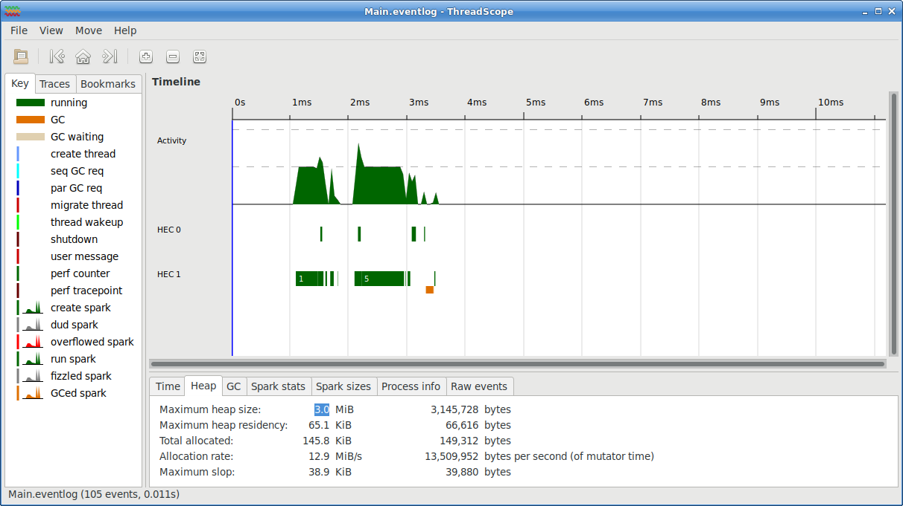

# Haskell Greatest Common Denominator

This is one of my early Haskell projects. I was using it to work out how to
structure a project, what tools to use. Later, when Git pipelines became
available, I explored how to use these to build the project.

The code was not as important as the project structure. Professionally as an
Developer + SCM + DevOps + Consultant I deal with enterprise projects with the
following features:

* code is version controlled
* code is styled and formatted by tools
* building code is controlled by a build system (Maven, Gradle, Make, Stack, etc)
* there are unit tests
* there are performance benchmarks
* API documentation is included
* documentation (this README, more often a wiki) is included

Originally I was using Cabal, but found that Stack managed dependencies and
project phases better. If you look at earlier commits you will see those
attempts. Perhaps, you can show me where I went wrong and should have stuck with
Cabal?

In this project, I will show how to:

- [lint](http://hackage.haskell.org/package/hlint), [style](https://hackage.haskell.org/package/stylish-haskell) source code
- build using [GNU Make](https://www.gnu.org/software/make/) using [Stack](https://docs.haskellstack.org/en/stable/README/)
- unit test with [HSpec](http://hackage.haskell.org/package/hspec)
- benchmark with [Criterion](http://hackage.haskell.org/package/criterion)
- document using [Haddock](http://hackage.haskell.org/package/haddock)
- profile using [GHC](https://www.haskell.org/ghc/)

It uses a couple of Greatest Common Denominator (GCD) algorithms as examples for
testing and benchmarking. The GCD algorithms are described
[here](https://en.wikipedia.org/wiki/Euclidean_algorithm).


## Documentation

API documentation is available from:

* [GitHub Pages](https://frankhjung.github.io/haskell-gcd/)
* [GitLab Pages](https://frankhjung1.gitlab.io/haskell-gcd)

Documentation is produced using [Haddock](http://hackage.haskell.org/package/haddock).

## Setup

To prime environment with compiler, packages and dependencies, run the
environment setup (see [Makefile](./Makefile) `setup` goal for full details):

```bash
make setup
```

Stack uses Cabal under the covers but does more package management.


## Build

Use the make goal `build`:

```bash
make build
```

For a rebuild of all targets run the `clean` goal first:

```bash
make clean build
```


## Tests

Run the `test` goal:

```bash
make test
```

### Example

```
$ make test

euclid1
  euclid1 1 1
    returns 1
  euclid1 371 379904
    returns 371
euclid2
  euclid2 1 1
    returns 1
  euclid2 371 379904
    returns 371
besout
  besout 1 1
    returns 1
  besout 371 379904
    returns 371

Finished in 0.0009 seconds
6 examples, 0 failures
```


## Benchmark

Benchmark the two Euclid _Greatest Common Denominator_ algorithms:

```bash
make bench
```

### Example

```
$ make bench

Registering library for GCD-0.4.0..
GCD-0.4.0: benchmarks
Running 1 benchmarks...
Benchmark benchmark: RUNNING...
benchmarking euclid1: /379904
time                 7.815 ns   (7.785 ns .. 7.843 ns)
                     1.000 R²   (1.000 R² .. 1.000 R²)
mean                 7.846 ns   (7.803 ns .. 7.912 ns)
std dev              181.2 ps   (115.0 ps .. 293.9 ps)
variance introduced by outliers: 38% (moderately inflated)

benchmarking euclid2: /379904
time                 7.761 ns   (7.740 ns .. 7.784 ns)
                     1.000 R²   (1.000 R² .. 1.000 R²)
mean                 7.790 ns   (7.757 ns .. 7.862 ns)
std dev              156.1 ps   (90.71 ps .. 307.2 ps)
variance introduced by outliers: 31% (moderately inflated)

benchmarking besout: /379904
time                 7.779 ns   (7.732 ns .. 7.834 ns)
                     1.000 R²   (0.999 R² .. 1.000 R²)
mean                 7.804 ns   (7.761 ns .. 7.874 ns)
std dev              184.9 ps   (117.5 ps .. 350.0 ps)
variance introduced by outliers: 39% (moderately inflated)

Benchmark benchmark: FINISH
```


## Profiling

### Using GHC

The following shows how to profile this application using GHC:

1. compile with profiling

```bash
$ ghc -prof -fprof-auto -rtsopts app/Main.hs src/GCD.hs
```

2. to profile run program with arguments:

```bash
$ app/Main 371 379904 +RTS -p
```

3. results are reported in `Main.prof`:

```
Fri Jul 27 23:05 2018 Time and Allocation Profiling Report  (Final)

   Main +RTS -p -RTS 371 379904

total time  =        0.00 secs   (1 ticks @ 1000 us, 1 processor)
total alloc =     112,632 bytes  (excludes profiling overheads)

COST CENTRE MODULE           SRC                         %time %alloc

euclid1     GCD              src/GCD.hs:(21,1)-(25,44)   100.0   43.6
CAF         GHC.IO.Handle.FD <entire-module>               0.0   30.8
CAF         GHC.IO.Encoding  <entire-module>               0.0    2.9
main        Main             app/Main.hs:(19,1)-(24,25)    0.0   12.0
main.(...)  Main             app/Main.hs:23:19-40          0.0    8.5


                                                                                         individual      inherited
COST CENTRE          MODULE                SRC                        no.     entries  %time %alloc   %time %alloc

MAIN                 MAIN                  <built-in>                 118          0    0.0    0.6   100.0  100.0
 CAF                 Main                  <entire-module>            234          0    0.0    0.1     0.0    0.2
  main               Main                  app/Main.hs:(19,1)-(24,25) 236          1    0.0    0.0     0.0    0.0
 CAF                 GHC.Conc.Signal       <entire-module>            226          0    0.0    0.6     0.0    0.6
 CAF                 GHC.IO.Encoding       <entire-module>            214          0    0.0    2.9     0.0    2.9
 CAF                 GHC.IO.Encoding.Iconv <entire-module>            212          0    0.0    0.2     0.0    0.2
 CAF                 GHC.IO.Handle.FD      <entire-module>            204          0    0.0   30.8     0.0   30.8
 CAF                 GHC.IO.Handle.Text    <entire-module>            202          0    0.0    0.1     0.0    0.1
 CAF                 Text.Read.Lex         <entire-module>            170          0    0.0    0.6     0.0    0.6
 main                Main                  app/Main.hs:(19,1)-(24,25) 237          0    0.0   11.9   100.0   64.1
  euclid1            GCD                   src/GCD.hs:(21,1)-(25,44)  238       1024  100.0   43.6   100.0   43.6
  euclid2            GCD                   src/GCD.hs:(29,1)-(32,41)  242          2    0.0    0.1     0.0    0.1
   euclid2.remainder GCD                   src/GCD.hs:32:21-41        243          2    0.0    0.0     0.0    0.0
  main.(...)         Main                  app/Main.hs:23:19-40       240          1    0.0    8.5     0.0    8.5
  main.u             Main                  app/Main.hs:23:19-40       239          1    0.0    0.0     0.0    0.0
  main.v             Main                  app/Main.hs:23:19-40       241          1    0.0    0.0     0.0    0.0
```


### Using ThreadScope

Another useful tool for performance profiling is
[ThreadScope](https://wiki.haskell.org/ThreadScope).

1. compile with multi-threaded runtime:

```bash
$ ghc -threaded -eventlog -rtsopts --make app/Main.hs src/GCD.hs
```

2. execute program and generate a profile use the `-ls` flag after `+RTS`.

```bash
$ app/Main 371 379904 +RTS -ls -N2
```

3. pass the profile into ThreadScope:

```bash
$ threadscope Main.eventlog
```

The following is example output for this process:




## Project Information

```bash
$ cabal info .

* GCD-0.4.0              (program and library)
    Synopsis:      Greatest Common Denominator
    Versions available: [ Not available from server ]
    Versions installed: [ Not installed ]
    Homepage:      https://github.com/frankhjung/gcd#readme
    Bug reports:   [ Not specified ]
    Description:   Test versions of Euclid's greatest common denominator
                   algorithm
    Category:      education
    License:       GPL-3
    Author:        Frank H Jung
    Maintainer:    frankhjung at linux.com
    Source repo:   git@github.com:frankhjung/haskell-gcd.git
    Executables:   gcd
    Dependencies:  base >=4.12, GCD -any, base >=4.12, GCD -any,
                   hspec >=2.6.1 && <=2.7.1, besout >=0.2, base >=4.12,
                   GCD -any, criterion >=1.5.4.0 && <=1.5.5.0, besout >=0.2,
                   base >=4.12
    Cached:        Yes
    Modules:
        GCD

```
